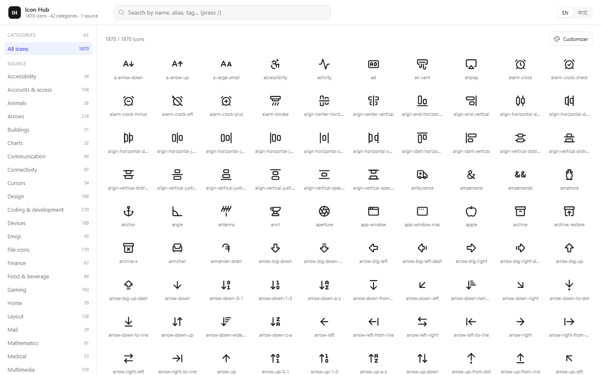
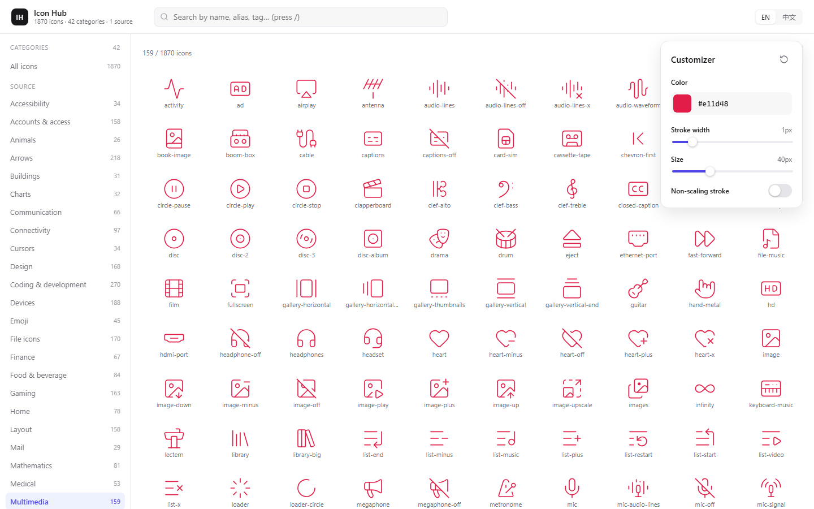

# Icon Hub

**[English](README.md)** · [简体中文](README.zh-CN.md)

> **One SQLite database plus one offline browser for the scattered open-source icon libraries.**
> Organised by each upstream's own categories and tags. Bilingual labels. Zero dependencies.




---

## Why

Every open-source icon library ships its own website, its own taxonomy, its own search box.
Work with a few of them and you end up with a dozen bookmarks and no way to search across all of them.

**Icon Hub** pulls them into one local workspace:

| | |
|---|---|
| **Native taxonomy** | Categories and tags come from each upstream — same names, same grouping, same order as the official site |
| **Fully offline** | Static HTML + SQLite. No server, no build step, no npm, no network calls |
| **Bilingual labels** | Every category and tag carries an `en` and a `zh` label; switch language instantly in the UI |
| **Multi-source by design** | A source is just a directory. Adding a library = writing one fetch script; the database and UI stay untouched |
| **Rebuildable** | The database and the front-end data are *derived*. Delete them anytime and regenerate from the source snapshot |

### Included so far

| Source | Icons | Categories | Aliases | License |
|---|---:|---:|---:|---|
| **Lucide** | 1,870 | 42 | 264 | ISC |
| **Tabler Icons** | 6,238 | 41 | 66 | MIT |
| **total** | **8,108** | **83** | **330** | — |

> Tabler ships two styles: 5,184 `outline` icons with full metadata, plus 1,054 `filled` variants.
> The filled set carries no category/tags upstream and duplicates outline names, so it is imported as
> `<name>-filled` (matching Tabler's own `IconXxxFilled` naming), inheriting metadata from its outline twin.

---

## Features

**Browse**
- 43-entry category sidebar (All + 42 categories) with icon counts, ordered like lucide.dev
- Responsive icon grid showing the whole set at once

**Search**
- Matches name / alias / tag / category, multiple keywords separated by spaces
- Press `/` to focus the search box
- **Chinese search works too** — typing 关闭 resolves to Chinese labels first, then maps back to icons
  (36 hits, including `x` and `power-off`)

**Detail drawer** — click any icon
- Live size / stroke-width / colour controls
- Copy SVG · Copy JSX · Copy name · Download `.svg`
- Full metadata: source, categories, tags, aliases

**Customizer** — global appearance for the whole grid, modelled on lucide.dev's customiser
- Colour (swatch + `#hex` field, 3-digit shorthand accepted, invalid values corrected on blur)
- Stroke width 0.5–4.0 px · Size 16–96 px · Non-scaling stroke toggle
- One-click reset; settings persist in `localStorage`; close with `Esc` or a click outside



**Shareable URLs** — the whole UI state lives in the query string:

```
index.html?lang=zh&q=close&cat=account&icon=user
index.html?cz=1&size=40&stroke=1&color=%23e11d48&nonscaling=1
```

---

## Quick start

```bash
git clone https://github.com/xmjerryyy/icon-hub.git
cd icon-hub

# 0. First run only — fetch the upstream snapshots into vendor/ (~40 MB total)
mkdir -p vendor && cd vendor
curl -L -o lucide-main.tar.gz https://codeload.github.com/lucide-icons/lucide/tar.gz/refs/heads/main
tar -xzf lucide-main.tar.gz
curl -L -o tabler-main.tar.gz https://codeload.github.com/tabler/tabler-icons/tar.gz/refs/heads/main
tar -xzf tabler-main.tar.gz && cd ..

# 1. Upstream snapshots → catalog/   (one script per source)
python scripts/fetch_lucide.py
python scripts/fetch_tabler.py

# 2. catalog/           → SQLite
python scripts/build_db.py

# 3. SQLite             → front-end data
python scripts/export_web.py

# 4. Open the UI — double-click web/index.html (works over file://)
#    or serve it, if your browser blocks local file access:
python -m http.server 8765 --directory web
#    → http://127.0.0.1:8765/
```

Only the Python standard library is required (3.10+). On Windows, run `chcp 65001` first if the console garbles Chinese output.

---

## Project structure

```
icon-hub/
├── catalog/<source>/
│   ├── source.json        source metadata (name, homepage, license, version, stats)
│   ├── categories.json    categories, bilingual fields
│   ├── icons.jsonl        one icon per line (tags / categories / aliases / svg path)
│   ├── zh.json            Chinese label layer, merged into the database when present
│   └── _zh_work/          translation workbench (chunked source list + translations)
├── icons/<source>/*.svg   the original SVG files, untouched
├── scripts/               fetch → build → export, plus the bilingual workflow
├── web/                   the browser UI (static, no dependencies)
├── data/icon-hub.db       SQLite database            (derived, not tracked)
├── web/data/*             front-end data             (derived, not tracked)
├── vendor/                upstream snapshots, large (not tracked — see Quick start step 0)
├── LICENSES.md            code license + per-source attribution obligations
└── licenses/              verbatim upstream license texts
```

`.gitignore` excludes `vendor/`, `data/*.db` and `web/data/*` — everything reproducible from
`catalog/` plus the upstream snapshot.

```
upstream snapshot ──fetch──▶ catalog/ ──build──▶ SQLite ──export──▶ web/data/ ──▶ UI
```

**The rule that matters:** the database and the front-end data are *derived*.
If you want something to survive a rebuild, write it into `catalog/`.

---

## Database

```
sources            icon sources (key / name_en / name_zh / license / version / stats)
categories         key / title_en / title_zh / description_en / description_zh / sort_order / icon_count
icons              source_key / name / primary_category / svg_path / deprecated
  └ aliases        deprecated former names (264 rows)
tags               vocabulary: key / label_en / label_zh (4,095 rows)
icon_categories    icon ↔ category (is_primary marks the official grouping)
icon_tags          icon ↔ tag (15,531 rows)
meta               schema_version / built_at / language settings
icons_fts          FTS5 full-text index over name / aliases / tags / categories
v_icons            view: one row per icon with categories, tags and aliases joined
v_stats            view: totals
```

Every user-facing string is a **pair of columns** (`*_en` / `*_zh`), which is what makes
language switching a pure front-end concern.

Handy queries:

```sql
-- search, including aliases and tags
SELECT name FROM icons_fts WHERE icons_fts MATCH 'close';

-- everything in one category
SELECT i.name FROM icons i
JOIN icon_categories ic ON ic.icon_id = i.id
JOIN categories c ON c.id = ic.category_id
WHERE c.key = 'account' ORDER BY i.name;

-- full record for one icon
SELECT * FROM v_icons WHERE name = 'user';
```

---

## Translations

Chinese lives in `catalog/<source>/zh.json` — one file per source:

| Source | Categories | Tags |
|---|---|---|
| Lucide | 42 (titles + descriptions) — complete | 4,095 — complete |
| Tabler | 41 — complete | pending (5,226 new words) |

**The tag vocabulary is shared across sources.** A tag that already exists in the database keeps its
Chinese label, so adding a new source inherits translations for free — that is why 68% of Tabler's
tag links came out already translated without any extra work.

Format:

```json
{
  "source_name_zh": "Lucide",
  "categories": {
    "accessibility": "无障碍",
    "account.description": "用于用户资料、身份、设置、会员以及个人账户操作的图标。"
  },
  "tags": { "close": "关闭", "delete": "删除" }
}
```

- keys under `categories` are category keys; append `.description` to translate a description
- keys under `tags` are the raw English tags
- any missing label **falls back to English** — the UI never shows a blank

### Editing translations

| Scenario | How |
|---|---|
| Fix a few labels | Edit `catalog/lucide/zh.json`, then `build_db.py` + `export_web.py` |
| Bulk re-translate | Edit `_zh_work/tags-NN.out.txt` → `python scripts/apply_zh.py` → rebuild |
| After an upstream update | `make_zh_worklist.py` regenerates the list → fill `*.out.txt` → `apply_zh.py` |

`_zh_work/` holds the workbench. Translation files are keyed by **line number, not by key**:

- `*.in.txt` — generated source list (`index \t english`), produced by `make_zh_worklist.py`
- `*.out.txt` — translations (`index \t chinese`)

`apply_zh.py` verifies the indices line by line and **aborts on any mismatch, gap or extra line**.
That is deliberate: hand-copying 4,095 keys is guaranteed to produce silent off-by-one errors,
and a misaligned translation is nearly impossible to spot afterwards. Index checking surfaces
the mistake at merge time instead.

---

## Updating upstream

Lucide's real source is the GitHub repository snapshot — **not** the npm package,
which does not carry category assignments.

```bash
cd vendor
curl -L -o lucide-main.tar.gz https://codeload.github.com/lucide-icons/lucide/tar.gz/refs/heads/main
tar -xzf lucide-main.tar.gz
cd ..
python scripts/fetch_lucide.py && python scripts/build_db.py && python scripts/export_web.py
```

Rebuilding never loses work, as long as your translations live in `catalog/<source>/zh.json`
rather than in the database.

---

## Adding a new source

> **This is no longer theoretical** — Tabler was added exactly this way, and neither the database
> schema nor the UI logic needed changes for it to show up.

The architecture is "one source, one directory". No database or UI code needs to change:

1. Fetch the new library (npm package, GitHub snapshot, official JSON — whatever it ships)
2. Write `scripts/fetch_<source>.py` producing the same three files:
   `catalog/<source>/source.json`, `categories.json`, `icons.jsonl`, with SVGs under `icons/<source>/`
3. Run `build_db.py` and `export_web.py` — the new source's categories and icons appear in the UI automatically

Every line of `icons.jsonl` looks like this:

```json
{"name":"user","categories":["account"],"tags":["person","account"],
 "aliases":["user-round"],"use_cases":[],"contributors":["..."],
 "deprecated":false,"svg_file":"icons/lucide/user.svg","svg_bytes":299}
```

Field names are fixed — everything downstream depends on them.

---

## Known limitations

- **Tabler tags are not translated yet.** 5,226 of them are new vocabulary; the other 68% automatically reuse Lucide's Chinese labels (the tag table is shared across sources). Untranslated ones fall back to English
- A few obscure terms were translated conservatively (`mistwarp` left as-is, `snake holder` rendered by meaning). Fix them in `zh.json` if you disagree
- Aliases (330) are only visible in the detail drawer; there are no standalone cards for them
- The grid renders at most 800 cells at a time — narrow it down with search or a category
- `web/data/catalog.js` is a 6 MB generated file — never edit it by hand

---

## License

- **Code** in `scripts/` and `web/`: MIT
- **Icon data**: copyright belongs to each upstream project. This repository only indexes and browses it.
  Lucide is ISC (100+ of its icons derive from Feather Icons and are MIT)
- **Redistribution**: you must keep the copyright notices and license texts —
  see [LICENSES.md](LICENSES.md) and [`licenses/`](licenses/)
