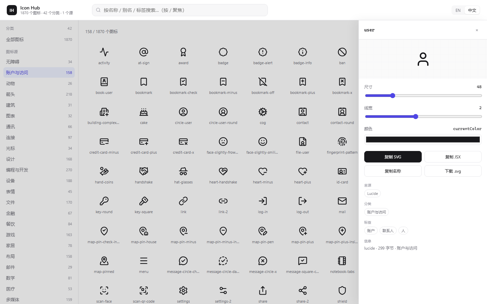

# Icon Hub · 本地图标库

[English](README.md) · **[简体中文](README.zh-CN.md)**

> **把分散各处的开源图标库，整合成一份本地 SQLite 数据库 + 一个离线浏览界面。**
> 按各上游自己的分类与标签组织，标签中英双语，零依赖。




---

## 为什么做这个

每个开源图标库都有自己的网站、自己的分类方式、自己的搜索框。
同时用几个库，收藏夹里就多出一堆网址，还没法跨库检索。

**Icon Hub** 把它们收进同一个本地工作区：

| | |
|---|---|
| **原生分类体系** | 分类与标签全部取自上游 —— 名称、分组、顺序都与官网一致 |
| **完全离线** | 静态 HTML + SQLite。不需要服务、不需要构建、不需要 npm、不发任何网络请求 |
| **双语标签** | 每个分类和标签都带 `en` / `zh` 两个字段，界面上一键切换 |
| **为多源设计** | 一个源就是一个目录。新增图标库 = 写一个采集脚本，数据库和界面代码都不用动 |
| **随时重建** | 数据库和前端数据都是**派生物**，随时删掉，从源数据重新生成 |

### 目前收录

| 源 | 图标 | 分类 | 标签 | 别名 | 许可 |
|---|---:|---:|---:|---:|---|
| **Lucide** | 1,870 | 42 | 4,095 | 264 | ISC |

---

## 功能

**浏览**
- 左侧 43 项分类栏（全部 + 42 个分类），带图标计数，顺序与 lucide.dev 官网一致
- 自适应图标网格，一次呈现全部图标

**搜索**
- 匹配 名称 / 别名 / 标签 / 分类，多个关键词用空格分隔
- 按 `/` 快速聚焦搜索框
- **中文也能搜** —— 输入「关闭」会先反查中文标签，再映射回图标
  （命中 36 个，含 `x`、`power-off`）

**详情抽屉** —— 点击任意图标
- 实时调节 尺寸 / 线宽 / 颜色
- 复制 SVG · 复制 JSX · 复制名称 · 下载 `.svg`
- 完整元信息：来源、分类、标签、别名

**Customizer** —— 控制整个网格的外观，仿 lucide.dev 的定制器
- 颜色（色块取色 + `#hex` 输入框，支持 3 位缩写，非法值失焦自动纠正）
- 线宽 0.5–4.0 px · 尺寸 16–96 px · 非缩放描边开关
- 一键重置；设置写入 `localStorage` 自动记住；点面板外或按 `Esc` 收起


**可分享链接** —— 整个界面状态都在查询串里：

```
index.html?lang=zh&q=close&cat=account&icon=user
index.html?cz=1&size=40&stroke=1&color=%23e11d48&nonscaling=1
```

---

## 快速开始

```bash
git clone https://github.com/xmjerryyy/icon-hub.git
cd icon-hub

# 0. 仅首次：下载上游快照（约 5.5 MB，解压到 vendor/lucide-main/）
mkdir -p vendor && cd vendor
curl -L -o lucide-main.tar.gz https://codeload.github.com/lucide-icons/lucide/tar.gz/refs/heads/main
tar -xzf lucide-main.tar.gz && cd ..

# 1. 上游快照 → catalog/
python scripts/fetch_lucide.py

# 2. catalog/ → SQLite
python scripts/build_db.py

# 3. SQLite → 前端数据
python scripts/export_web.py

# 4. 打开界面 —— 直接双击 web/index.html（file:// 可用）
#    若浏览器限制本地文件访问，改用本地服务：
python -m http.server 8765 --directory web
#    → http://127.0.0.1:8765/
```

只需 Python 标准库（3.10+）。Windows 下若控制台中文乱码，先执行 `chcp 65001`。

---

## 目录结构

```
icon-hub/
├── catalog/<源>/
│   ├── source.json        源元信息（名称、主页、许可、版本、统计）
│   ├── categories.json    分类，双语字段
│   ├── icons.jsonl        一行一个图标（标签 / 分类 / 别名 / SVG 路径）
│   ├── zh.json            中文译文层，存在则合并进数据库
│   └── _zh_work/          翻译工作区（分块清单 + 译文）
├── icons/<源>/*.svg       原始 SVG 文件，原样保存
├── scripts/               采集 → 建库 → 导出，以及双语工作流
├── web/                   浏览界面（纯静态，无依赖）
├── data/icon-hub.db       SQLite 数据库        （派生物，不入库）
├── web/data/*             前端数据             （派生物，不入库）
├── vendor/                上游快照，120 MB+    （不入库 —— 见快速开始第 0 步）
├── LICENSES.md            代码许可 + 各源的署名义务
└── licenses/              各上游许可原文
```

`.gitignore` 排除了 `vendor/`、`data/*.db`、`web/data/*` —— 它们都能从 `catalog/` 加上游快照重建。

```
上游快照 ──fetch──▶ catalog/ ──build──▶ SQLite ──export──▶ web/data/ ──▶ 界面
```

**最关键的一条规矩：** 数据库和前端数据都是**派生物**。
要让内容活过重建，就写进 `catalog/`。

---

## 数据库结构

```
sources            图标源（key / name_en / name_zh / license / version / 统计）
categories         key / title_en / title_zh / description_en / description_zh / sort_order / icon_count
icons              source_key / name / primary_category / svg_path / deprecated
  └ aliases        已废弃的旧名（264 条）
tags               标签词表：key / label_en / label_zh（4,095 条）
icon_categories    图标 ↔ 分类（is_primary 标记官网的主要归类）
icon_tags          图标 ↔ 标签（15,531 条）
meta               schema_version / built_at / 语言设置
icons_fts          FTS5 全文索引，覆盖 name / aliases / tags / categories
v_icons            视图：一行拿到单个图标的分类、标签、别名
v_stats            视图：各类总数
```

所有面向用户的文案都是**成对的列**（`*_en` / `*_zh`）—— 正因如此，语言切换纯粹是前端的事。

常用查询：

```sql
-- 搜索（含别名与标签命中）
SELECT name FROM icons_fts WHERE icons_fts MATCH 'close';

-- 某个分类下的全部图标
SELECT i.name FROM icons i
JOIN icon_categories ic ON ic.icon_id = i.id
JOIN categories c ON c.id = ic.category_id
WHERE c.key = 'account' ORDER BY i.name;

-- 某个图标的完整记录
SELECT * FROM v_icons WHERE name = 'user';
```

---

## 翻译

英文与中文**均已 100% 完成**：42 个分类（标题 + 描述）与 4,095 个标签。
中文写在 `catalog/<源>/zh.json`：

```json
{
  "source_name_zh": "Lucide",
  "categories": {
    "accessibility": "无障碍",
    "account.description": "用于用户资料、身份、设置、会员以及个人账户操作的图标。"
  },
  "tags": { "close": "关闭", "delete": "删除" }
}
```

- `categories` 的键是分类 key，加 `.description` 后缀可翻译描述
- `tags` 的键是英文标签原文
- 任何缺失的译文都会**回退英文** —— 界面不会出现空白

### 修改译文

| 场景 | 做法 |
|---|---|
| 改几条 | 编辑 `catalog/lucide/zh.json`，再跑 `build_db.py` + `export_web.py` |
| 批量重译 | 改 `_zh_work/tags-NN.out.txt` → `python scripts/apply_zh.py` → 重新建库导出 |
| 上游更新后 | `make_zh_worklist.py` 重新生成清单 → 补 `*.out.txt` → `apply_zh.py` |

`_zh_work/` 是翻译工作区。译文文件**按行号而不是按 key 对齐**：

- `*.in.txt` —— 自动生成的原文清单（`序号 \t 英文`），由 `make_zh_worklist.py` 产出
- `*.out.txt` —— 译文（`序号 \t 中文`）

`apply_zh.py` 会逐行校验序号，**任何错位、缺失或多出的行都会直接报错退出**。
这是刻意的：手工搬运 4,095 个 key 几乎必然产生难以察觉的错位，
而张冠李戴的译文事后极难发现。序号校验把错误挡在合并阶段。

---

## 更新上游数据

Lucide 的真源是 GitHub 仓库快照 —— **不是** npm 包，npm 包里没有分类归属。

```bash
cd vendor
curl -L -o lucide-main.tar.gz https://codeload.github.com/lucide-icons/lucide/tar.gz/refs/heads/main
tar -xzf lucide-main.tar.gz
cd ..
python scripts/fetch_lucide.py && python scripts/build_db.py && python scripts/export_web.py
```

重建永远不会丢东西 —— 前提是你的译文写在 `catalog/<源>/zh.json` 里，而不是直接改数据库。

---

## 接入新的图标源

架构是「一个源 = 一个目录」，不需要改数据库和界面代码：

1. 把新库的数据抓下来（npm 包 / GitHub 快照 / 官方 JSON 都行）
2. 写 `scripts/fetch_<源>.py`，产出与 Lucide 相同的三份文件：
   `catalog/<源>/source.json`、`categories.json`、`icons.jsonl`，SVG 放 `icons/<源>/`
3. 跑 `build_db.py` 和 `export_web.py` —— 新源的分类和图标会自动出现在界面里

`icons.jsonl` 每行的格式：

```json
{"name":"user","categories":["account"],"tags":["person","account"],
 "aliases":["user-round"],"use_cases":[],"contributors":["..."],
 "deprecated":false,"svg_file":"icons/lucide/user.svg","svg_bytes":299}
```

字段名是固定的 —— 下游全部依赖它。

---

## 已知限制

- 少数冷门词做了保守翻译（`mistwarp` 保留原文、`snake holder` 按意译处理），不认同可直接改 `zh.json`
- 别名（264 个）只能在详情抽屉里看到，没有独立卡片
- 网格一次渲染全部 1,870 个结果（首屏约 0.3 秒）。源变多后需要分页或虚拟滚动
- `web/data/catalog.js` 是 1.4 MB 的生成物，不要手工编辑

---

## 许可

- **代码**（`scripts/`、`web/`）：MIT
- **图标数据**：版权归各上游项目所有，本仓库只做本地索引与浏览。
  Lucide 采用 ISC（其中 100+ 个图标派生自 Feather Icons，适用 MIT）
- **再分发义务**：必须保留版权声明与许可原文 —— 详见 [LICENSES.md](LICENSES.md) 与 [`licenses/`](licenses/)
